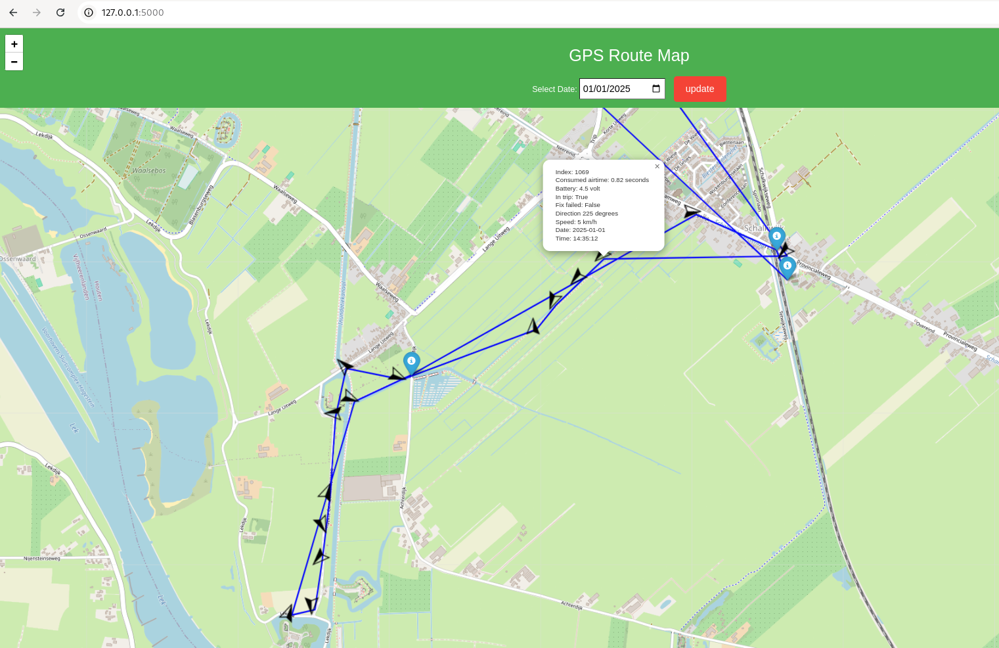

# Oyster3-lorawan GPS tracker

This project is designed to help you seamlessly integrate and utilize the Digital Matter Oyster3 GPS tracker with The Things Network (TTN). The Oyster3 is a robust, low-power, and highly accurate GPS tracking device, making it ideal for a wide range of IoT applications, including asset tracking, fleet management, and environmental monitoring.

This repository provides a comprehensive guide and resources for configuring the Oyster3 GPS tracker, decoding its payloads, and leveraging TTN for data transmission and visualization. Whether you're an IoT enthusiast, a developer, or a company looking to deploy a scalable GPS tracking solution, this project will help you get started quickly and effectively.

### Features

* Device Configuration: Script to configure the Oyster 3 device using Lorawan Downlinks (No additional software and hardware required).
* Visualization: Webserver to visualize GPS data plotted on Openstreet Map with GPS marker with date selector.
* Payload Encoding/Decoding: Detailed payload formating
* TTN Integration: Guide for connecting your tracker to lorawan TTN (The Thing Network).
* Should be compatible the previous model Oyster LoRaWAN. Not tested. Check the documentation!

## Scripts

### Requierments

Important: Setup the Oyster 3 device in TTN (The Thing Network): https://support.digitalmatter.com/351-setup-devices-on-the-things-network-v3

TTN is free completly if you have less than 10 devices.

Export the following environment variables with our own configuration:
````bash
$ export TTN_DEVICE="TTN device id"
$ export TTN_APPLICATION="TTN application name"
$ export TTN_REGION="TTN region"
$ export TTN_CONSOLE="TTN console name"
$ export TTN_API_KEY="TTN API key"
$ export TTN_NUMBER_OF_RECORDS=0  # How many records you want, set to 0 if you want everything available
$ export TTN_SINCE_DATE_TIME="2024-11-21T10:00:00Z"
````

Install the following pip packages:
````bash
$ pip install bitstring flask folium urllib3 request PyYAML
````

You may need to open port 5000 in the firewall:
````bash
$ sudo firewall-cmd --permanent --add-port=5000/tcp
````

### Run webserver with tracking marker on Open Streetmap

The webserver.py script is designed to provide a lightweight, local web server (flask & Folium) interface for visualizing GPS data from the Oyster3 LoRaWAN GPS Tracker on Open Streeetmap. It enables users to select GPS data from a specific data and view the route using GPS markers in a user-friendly way through a browser-based interface.

The script retrieves the latest GPS data from Oyster 3 everytime you click on the *update* button and saves the data in [./json/filename.json](./json/) as well as [./files/filename.txt](./files/).

Start the webserver:
````bash
$ python ./webserver.py
````
View in the webbrowser: http://localhost:5000



### Configure Oyster3-lorawan using downlinks

Configuring the Digital Matter Oyster3 LoRaWAN GPS Tracker involves sending downlink messages from your LoRaWAN network server, such as The Things Network (TTN). Downlinks are used to update the device's settings remotely, enabling you to customize its behavior for specific use cases like asset tracking, fleet management, or environmental monitoring.

Set relevant values in the [config.yaml](./config.yaml) file for a particular downlink. Also change the sequence number, so you can later on verify if the configuration was made to the device. Check the [Oyster3-Lorawan-Integration Manual](docs/Oyster3-LoRaWAN-Integration-1.3.pdf) for the details.

Be aware that some 'faulty' configuration changes on the downlink 7, 8 or 9 (all related to the Lorawan configuration) can make the device unreachable. However, all other 'faulty' configurations can be undone by applying the correct configuration.

Validate the output by running the configure-using-downlinks.py script (without the --send option):
````bash
$ python ./configure-using-downlinks.py --downlink 9

Send downlink: False
downlink9 Byte Array: 020741ff657f00

D | B | B | L | Type    | V   | Bitstring  | Bytearray              | Description
o | y | i | e |         | a   |            |                        |
w | t | t | n |         | l   | [effected  | [effected              |
n | e |   | g |         | u   | bit(s)]    | byte(s)]               |
l |   |   | t |         | e   |            |                        |
k |   |   | h |         |     |            |                        |
============================================================================================================================================
9 | 0 | 0 | 7 | integer | 1   | [0000001]0 | [02]00:00:00:00:00:00: | 0.0 - 0.6 Downlink sequence number (reported in acknowledgement)
--------------------------------------------------------------------------------------------------------------------------------------------
9 | 0 | 7 | 1 | boolean | 0   | 0000001[0] | [02]00:00:00:00:00:00: | 0.7 Reserved, set to zero
--------------------------------------------------------------------------------------------------------------------------------------------
9 | 1 | - | 1 | integer | 7   | [00000111] | :02[07]00:00:00:00:00: | 1 Days between network joins, 0 disables, default 7
--------------------------------------------------------------------------------------------------------------------------------------------
9 | 2 | 0 | 2 | integer | 1   | [01]000000 | :02:07[40]00:00:00:00: | 2.0 - 2.1 ADR support, 0= Never, 1= When out-of-trip, 2= Always,
  |   |   |   |         |     |            |                        | default 1
--------------------------------------------------------------------------------------------------------------------------------------------
9 | 2 | 2 | 2 | integer | 0   | 01[00]0000 | :02:07[40]00:00:00:00: | 2.2 - 2.3 Reserved, set to zero
--------------------------------------------------------------------------------------------------------------------------------------------
9 | 2 | 4 | 4 | integer | 1   | 0100[0001] | :02:07[41]00:00:00:00: | 2.4 - 2.7 Initial frame repetitions (NbTrans/Reps), 1-15, default 1
--------------------------------------------------------------------------------------------------------------------------------------------
9 | 3 | 0 | 4 | integer | 15  | [1111]0000 | :02:07:41[f0]00:00:00: | 3.0 - 3.3 Initial MaxCount0, sets uplinks between Rejoin0 attempts in
  |   |   |   |         |     |            |                        | LoRaWAN 1.1 OTAA, uplink interval equals 2^(4+MaxCount0), default 15
--------------------------------------------------------------------------------------------------------------------------------------------
9 | 3 | 4 | 4 | integer | 15  | 1111[1111] | :02:07:41[ff]00:00:00: | 3.4 - 3.7 Initial MaxTime0, sets approx. time between Rejoin0 attempts
  |   |   |   |         |     |            |                        | in LoRaWAN 1.1 OTAA, uplink period equals 2^(10+MaxTime0) s, default
  |   |   |   |         |     |            |                        | 15
--------------------------------------------------------------------------------------------------------------------------------------------
9 | 4 | 0 | 4 | integer | 6   | [0110]0000 | :02:07:41:ff[60]00:00: | 4.0 - 4.3 Initial AdrAckLimitExp, sets uplinks between ADR
  |   |   |   |         |     |            |                        | confirmation requests, uplink interval equals 2^AdrAckLimitExp,
  |   |   |   |         |     |            |                        | default 6 (limit is 64)
--------------------------------------------------------------------------------------------------------------------------------------------
9 | 4 | 4 | 4 | integer | 5   | 0110[0101] | :02:07:41:ff[65]00:00: | 4.4 - 4.7 Initial AdrAckDelayExp, sets uplinks between ADR backoff
  |   |   |   |         |     |            |                        | steps, uplink interval equals 2^AdrAckDelayExp, default 5 (delay is
  |   |   |   |         |     |            |                        | 32)
--------------------------------------------------------------------------------------------------------------------------------------------
9 | 5 | - | 1 | integer | 127 | [01111111] | :02:07:41:ff:65[7f]00: | 5 Maximum Tx power limit, signed, -128-127= -128 to 127 dBm EIRP,
  |   |   |   |         |     |            |                        | default 127 (no limit)
--------------------------------------------------------------------------------------------------------------------------------------------
9 | 6 | - | 1 | integer | 0   | [00000000] | :02:07:41:ff:65:7f[00] | 6 Random Tx delay, 0= disabled, 1-127= 1-127 seconds, 129-255= 1-127
  |   |   |   |         |     |            |                        | minutes, default disabled
--------------------------------------------------------------------------------------------------------------------------------------------
````

After validating the output, run it with the --send option and wait until the Oyster3 device confirmed the configuration change. This could take quite a while:
````bash
$ python ./configure-using-downlinks.py --downlink 9 --send

Send downlink: True
downlink9 Byte Array: 020741ff657f00
Downlink sent successfully. Status code: 200
sequence_number: 1
Response Code: 200
Missing Downlink Ack. Try again in 30 seconds...
Response Code: 200
Missing Downlink Ack. Try again in 30 seconds...
MATCH: Received_at: 2025-01-05T13:56:56.256908367Z, sequence number: 1, accepted: True, downlink_port_number: 9

D | B | B | L | Type    | V   | Bitstring  | Bytearray              | Description
o | y | i | e |         | a   |            |                        |
w | t | t | n |         | l   | [effected  | [effected              |
n | e |   | g |         | u   | bit(s)]    | byte(s)]               |
l |   |   | t |         | e   |            |                        |
k |   |   | h |         |     |            |                        |
============================================================================================================================================
9 | 0 | 0 | 7 | integer | 1   | [0000001]0 | [02]00:00:00:00:00:00: | 0.0 - 0.6 Downlink sequence number (reported in acknowledgement)
--------------------------------------------------------------------------------------------------------------------------------------------
9 | 0 | 7 | 1 | boolean | 0   | 0000001[0] | [02]00:00:00:00:00:00: | 0.7 Reserved, set to zero
--------------------------------------------------------------------------------------------------------------------------------------------
9 | 1 | - | 1 | integer | 7   | [00000111] | :02[07]00:00:00:00:00: | 1 Days between network joins, 0 disables, default 7
--------------------------------------------------------------------------------------------------------------------------------------------
9 | 2 | 0 | 2 | integer | 1   | [01]000000 | :02:07[40]00:00:00:00: | 2.0 - 2.1 ADR support, 0= Never, 1= When out-of-trip, 2= Always,
  |   |   |   |         |     |            |                        | default 1
--------------------------------------------------------------------------------------------------------------------------------------------
9 | 2 | 2 | 2 | integer | 0   | 01[00]0000 | :02:07[40]00:00:00:00: | 2.2 - 2.3 Reserved, set to zero
--------------------------------------------------------------------------------------------------------------------------------------------
9 | 2 | 4 | 4 | integer | 1   | 0100[0001] | :02:07[41]00:00:00:00: | 2.4 - 2.7 Initial frame repetitions (NbTrans/Reps), 1-15, default 1
--------------------------------------------------------------------------------------------------------------------------------------------
9 | 3 | 0 | 4 | integer | 15  | [1111]0000 | :02:07:41[f0]00:00:00: | 3.0 - 3.3 Initial MaxCount0, sets uplinks between Rejoin0 attempts in
  |   |   |   |         |     |            |                        | LoRaWAN 1.1 OTAA, uplink interval equals 2^(4+MaxCount0), default 15
--------------------------------------------------------------------------------------------------------------------------------------------
9 | 3 | 4 | 4 | integer | 15  | 1111[1111] | :02:07:41[ff]00:00:00: | 3.4 - 3.7 Initial MaxTime0, sets approx. time between Rejoin0 attempts
  |   |   |   |         |     |            |                        | in LoRaWAN 1.1 OTAA, uplink period equals 2^(10+MaxTime0) s, default
  |   |   |   |         |     |            |                        | 15
--------------------------------------------------------------------------------------------------------------------------------------------
9 | 4 | 0 | 4 | integer | 6   | [0110]0000 | :02:07:41:ff[60]00:00: | 4.0 - 4.3 Initial AdrAckLimitExp, sets uplinks between ADR
  |   |   |   |         |     |            |                        | confirmation requests, uplink interval equals 2^AdrAckLimitExp,
  |   |   |   |         |     |            |                        | default 6 (limit is 64)
--------------------------------------------------------------------------------------------------------------------------------------------
9 | 4 | 4 | 4 | integer | 5   | 0110[0101] | :02:07:41:ff[65]00:00: | 4.4 - 4.7 Initial AdrAckDelayExp, sets uplinks between ADR backoff
  |   |   |   |         |     |            |                        | steps, uplink interval equals 2^AdrAckDelayExp, default 5 (delay is
  |   |   |   |         |     |            |                        | 32)
--------------------------------------------------------------------------------------------------------------------------------------------
9 | 5 | - | 1 | integer | 127 | [01111111] | :02:07:41:ff:65[7f]00: | 5 Maximum Tx power limit, signed, -128-127= -128 to 127 dBm EIRP,
  |   |   |   |         |     |            |                        | default 127 (no limit)
--------------------------------------------------------------------------------------------------------------------------------------------
9 | 6 | - | 1 | integer | 0   | [00000000] | :02:07:41:ff:65:7f[00] | 6 Random Tx delay, 0= disabled, 1-127= 1-127 seconds, 129-255= 1-127
  |   |   |   |         |     |            |                        | minutes, default disabled
--------------------------------------------------------------------------------------------------------------------------------------------
````
If you don't get an acknowledgement in time it doesn't mean the device configuration has failed. Sometimes it takes ages for a downlink to be comfirmed. It is always possible to check the acknowledgement later using the ack.py script.

To check acknowledgement, specify the correct downlink and sequence number:
````bash
$ python ./ack.py  --downlink 9 --sequencenumber 2
Response Code: 200
NO_MATCH acknowledged: received_at: 2025-01-04T20:56:24.896061304Z, sequence number: 1, accepted: True, downlink_port_number: 9
MATCH:   acknowledged: received_at: 2025-01-05T13:56:56.256908367Z, sequence number: 2, accepted: True, downlink_port_number: 9
Try again in 30 seconds...
````

## Docs

* [docs/Oyster3- LoRaWAN-Configuration-and-Usage-Guide-Digital-Matter.pdf](./docs/Oyster3-LoRaWAN-Configuration-and-Usage-Guide-Digital-Matter.pdf)
* [docs/Oyster3-LoRaWAN-Datasheet-Digital-Matter-2024.pdf](./docs/Oyster3-LoRaWAN-Datasheet-Digital-Matter-2024.pdf)
* [docs/Oyster3-LoRaWAN-GPS-Battery-Powered-LoRa-Tracker.pdf](./docs/Oyster3-LoRaWAN-GPS-Battery-Powered-LoRa-Tracker.pdf)
* [docs/Oyster3-LoRaWAN-Integration-1.3.pdf](./docs/Oyster3-LoRaWAN-Integration-1.3.pdf)
* https://www.digitalmatter.com/devices/oyster-lorawan/
* https://www.digitalmatter.com/wp-content/uploads/2024/03/Oyster3-LoRaWAN-Datasheet-Digital-Matter-2024.pdf
* https://static.helpjuice.com/helpjuice_production/uploads/upload/image/14099/3479218/1694608512517-Oyster%2B3%2BLoRaWAN%2BIntegration%2B1.3.pdf
* https://support.digitalmatter.com/oyster3-lorawan/oyster-3-lorawan%C2%AE-configuration-and-usage-guide

## The Thing Network

* https://\<CONSOLE_NAME\>.\<REGION\>.cloud.thethings.industries/console/applications/<APLICATION>/devices/<DEVICE>/data
* https://\<CONSOLE_NAME\>.\<REGION\>.cloud.thethings.industries/noc/d/extended-ttsenddevice/end-device-details?from=now-2d&to=now-5m&var-end_device_id=<DEVICE_ID>&var-application_id=<APPLICATION_ID>&orgId=1300


## Oyster 3 LoRaWAN Uplink 1 Decoder

Test links:

* https://support.digitalmatter.com/oyster3-lorawan/decoding-the-oyster-3-lorawan%C2%AE-uplink
* https://www.oemserver.com/tools/Oyster3LoRaWAN/oyster3-lr-html-decoder.html

````
Oyster 3 LoRaWAN Uplink Decoder

Port: 1
Hex/Base64: 56ae401fef84083645920b5
Rx Time: 04 Mar 2022 14:03:00 GMT
{
  "type": "position",
  "inTrip": false,
  "fixFailed": false,
  "batV": 4.525,
  "inactivityAlarm": null,
  "batCritical": null,
  "latitudeDeg": 53.185615,
  "longitudeDeg": 6.0089967,
  "headingDeg": 201,
  "speedKmph": 55
}
````

## Configuration using Downlinks


### Configuration Downlink Port 1
Set Trip Parameters
````bash
$ python ./configure-using-downlinks.py --downlink 1
Send downlink: False
downlink1 Byte Array: 02981e8a8af80201

D | B | B | L | Type    | V     | Bitstring  | Bytearray                 | Description
o | y | i | e |         | a     |            |                           |
w | t | t | n |         | l     | [effected  | [effected                 |
n | e |   | g |         | u     | bit(s)]    | byte(s)]                  |
l |   |   | t |         | e     |            |                           |
k |   |   | h |         |       |            |                           |
=================================================================================================================================================
1 | 0 | 0 | 7 | integer | 1     | [0000001]0 | [02]00:00:00:00:00:00:00: | 0.0 - 0.6 Downlink sequence number (reported in acknowledgement)
-------------------------------------------------------------------------------------------------------------------------------------------------
1 | 0 | 7 | 1 | boolean | False | 0000001[0] | [02]00:00:00:00:00:00:00: | 0.7 Ignore V1 parameters on Oyster 3, default 0 (apply closest match)
-------------------------------------------------------------------------------------------------------------------------------------------------
1 | 1 | - | 1 | integer | 152   | [10011000] | :02[98]00:00:00:00:00:00: | 1 Max time between fix attempts out of trip ('heartbeat'), 1-127=
  |   |   |   |         |       |            |                           | 1-127 mins, 129-255= 1-127 hours, default 24 hours.
-------------------------------------------------------------------------------------------------------------------------------------------------
1 | 2 | - | 1 | integer | 30    | [00011110] | :02:98[1e]00:00:00:00:00: | 2 Trip end timeout, LSb = 10s without accelerometer detecting
  |   |   |   |         |       |            |                           | movement, 0 disables trip tracking entirely (heartbeats only), default
  |   |   |   |         |       |            |                           | 5 mins.
-------------------------------------------------------------------------------------------------------------------------------------------------
1 | 3 | - | 1 | integer | 138   | [10001010] | :02:98:1e[8a]00:00:00:00: | 3 Time between fix attempts in-trip during work hours, 1-127= 1-127
  |   |   |   |         |       |            |                           | seconds, 129-255= 1-127 minutes, 0 or 128 disables, default 10 mins.
-------------------------------------------------------------------------------------------------------------------------------------------------
1 | 4 | - | 1 | integer | 138   | [10001010] | :02:98:1e:8a[8a]00:00:00: | 4 Time between fix attempts in-trip after hours, 1-127= 1-127 seconds,
  |   |   |   |         |       |            |                           | 129-255= 1-127 minutes, 0 or 128 disables, default 10 mins.
-------------------------------------------------------------------------------------------------------------------------------------------------
1 | 5 | 0 | 1 | boolean | True  | [1]0000000 | :02:98:1e:8a:8a[80]00:00: | 5.0 Fix on start of trips during work hours, default true.
-------------------------------------------------------------------------------------------------------------------------------------------------
1 | 5 | 1 | 1 | boolean | True  | 1[1]000000 | :02:98:1e:8a:8a[c0]00:00: | 5.1 Fix on end of trips during work hours, default true.
-------------------------------------------------------------------------------------------------------------------------------------------------
1 | 5 | 2 | 1 | boolean | True  | 11[1]00000 | :02:98:1e:8a:8a[e0]00:00: | 5.2 Fix on start of trips after hours, default true.
-------------------------------------------------------------------------------------------------------------------------------------------------
1 | 5 | 3 | 1 | boolean | True  | 111[1]0000 | :02:98:1e:8a:8a[f0]00:00: | 5.3 Fix on end of trips after hours, default true.
-------------------------------------------------------------------------------------------------------------------------------------------------
1 | 5 | 4 | 1 | boolean | True  | 1111[1]000 | :02:98:1e:8a:8a[f8]00:00: | 5.4 Optimise GNSS for trip tracking (download all ephemerides),
  |   |   |   |         |       |            |                           | default true.
-------------------------------------------------------------------------------------------------------------------------------------------------
1 | 5 | 5 | 1 | boolean | False | 11111[0]00 | :02:98:1e:8a:8a[f8]00:00: | 5.5 V1 Disable stats messages (Uplinks 3 and 31), default 0 (send
  |   |   |   |         |       |            |                           | both).
-------------------------------------------------------------------------------------------------------------------------------------------------
1 | 5 | 6 | 1 | boolean | False | 111110[0]0 | :02:98:1e:8a:8a[f8]00:00: | 5.6 Disable wakeup filtering during work hours, 1= only apply
  |   |   |   |         |       |            |                           | accelerometer wakeup threshold and count, 0= apply threshold, count,
  |   |   |   |         |       |            |                           | and filter, default 0
-------------------------------------------------------------------------------------------------------------------------------------------------
1 | 5 | 7 | 1 | boolean | False | 1111100[0] | :02:98:1e:8a:8a[f8]00:00: | 5.7 Disable wakeup filtering after hours, 1= only apply accelerometer
  |   |   |   |         |       |            |                           | wakeup threshold and count, 0= apply threshold, count, and filter,
  |   |   |   |         |       |            |                           | default 0
-------------------------------------------------------------------------------------------------------------------------------------------------
1 | 6 | - | 1 | integer | 2     | [00000010] | :02:98:1e:8a:8a:f8[02]00: | 6 V1 Accelerometer wakeup threshold, 1-8= 63-504 mG, default 126 mG.
-------------------------------------------------------------------------------------------------------------------------------------------------
1 | 7 | - | 1 | integer | 1     | [00000001] | :02:98:1e:8a:8a:f8:02[01] | 7 V1 Accelerometer wakeup count, 1-12= 80-960 ms, default 80 ms
-------------------------------------------------------------------------------------------------------------------------------------------------
````

### Configuration Downlink Port 2
Set After-Hours 1
````bash
$ python ./configure-using-downlinks.py --downlink 2
Send downlink: False
downlink2 Byte Array: 020000000000000000

D | B | B | L | Type    | V | Bitstring  | Bytearray                    | Description
o | y | i | e |         | a |            |                              |
w | t | t | n |         | l | [effected  | [effected                    |
n | e |   | g |         | u | bit(s)]    | byte(s)]                     |
l |   |   | t |         | e |            |                              |
k |   |   | h |         |   |            |                              |
================================================================================================================================================
2 | 0 | 0 | 7 | integer | 1 | [0000001]0 | [02]00:00:00:00:00:00:00:00: | 0.0 - 0.6 Downlink sequence number (reported in acknowledgement)
------------------------------------------------------------------------------------------------------------------------------------------------
2 | 0 | 7 | 1 | boolean | 0 | 0000001[0] | [02]00:00:00:00:00:00:00:00: | 0.7 Reserved, set to zero
------------------------------------------------------------------------------------------------------------------------------------------------
2 | 1 | - | 1 | integer | 0 | [00000000] | :02[00]00:00:00:00:00:00:00: | 1 Start of after-hours period on Monday, LSb = 7m30s since 00:00 local
  |   |   |   |         |   |            |                              | time, setting to end time indicates no after-hours period, default 0
------------------------------------------------------------------------------------------------------------------------------------------------
2 | 2 | - | 1 | integer | 0 | [00000000] | :02:00[00]00:00:00:00:00:00: | 2 End of after-hours period on Monday, LSb = 7m30s since 00:00 local
  |   |   |   |         |   |            |                              | time, setting to start time + 1 indicates a 7m30s after-hours period,
  |   |   |   |         |   |            |                              | set start time to 00:00 and end time to 24:00 to indicate the whole
  |   |   |   |         |   |            |                              | day is after-hours, default 0
------------------------------------------------------------------------------------------------------------------------------------------------
2 | 3 | - | 1 | integer | 0 | [00000000] | :02:00:00[00]00:00:00:00:00: | 3 Start of after-hours period on Tuesday, see above
------------------------------------------------------------------------------------------------------------------------------------------------
2 | 4 | - | 1 | integer | 0 | [00000000] | :02:00:00:00[00]00:00:00:00: | 4 End of after-hours period on Tuesday, see above
------------------------------------------------------------------------------------------------------------------------------------------------
2 | 5 | - | 1 | integer | 0 | [00000000] | :02:00:00:00:00[00]00:00:00: | 5 Start of after-hours period on Wednesday, see above
------------------------------------------------------------------------------------------------------------------------------------------------
2 | 6 | - | 1 | integer | 0 | [00000000] | :02:00:00:00:00:00[00]00:00: | 6 End of after-hours period on Wednesday, see above
------------------------------------------------------------------------------------------------------------------------------------------------
2 | 7 | - | 1 | integer | 0 | [00000000] | :02:00:00:00:00:00:00[00]00: | 7 Start of after-hours period on Thursday, see above
------------------------------------------------------------------------------------------------------------------------------------------------
2 | 8 | - | 1 | integer | 0 | [00000000] | :02:00:00:00:00:00:00:00[00] | 8 End of after-hours period on Thursday, see above
------------------------------------------------------------------------------------------------------------------------------------------------
````

### Configuration Downlink Port 3
Set After-Hours 2
````bash
$ python ./configure-using-downlinks.py --downlink 3
Send downlink: False
downlink3 Byte Array: 02000000000000

D | B | B | L | Type    | V | Bitstring  | Bytearray              | Description
o | y | i | e |         | a |            |                        |
w | t | t | n |         | l | [effected  | [effected              |
n | e |   | g |         | u | bit(s)]    | byte(s)]               |
l |   |   | t |         | e |            |                        |
k |   |   | h |         |   |            |                        |
==========================================================================================================================================
3 | 0 | 0 | 7 | integer | 1 | [0000001]0 | [02]00:00:00:00:00:00: | 0.0 - 0.6 Downlink sequence number (reported in acknowledgement)
------------------------------------------------------------------------------------------------------------------------------------------
3 | 0 | 7 | 1 | boolean | 0 | 0000001[0] | [02]00:00:00:00:00:00: | 0.7 Reserved, set to zero
------------------------------------------------------------------------------------------------------------------------------------------
3 | 1 | - | 1 | integer | 0 | [00000000] | :02[00]00:00:00:00:00: | 1 Start of after-hours period on Friday, LSb = 7m30s since 00:00 local
  |   |   |   |         |   |            |                        | time, setting to end time indicates no after-hours period, default 0
------------------------------------------------------------------------------------------------------------------------------------------
3 | 2 | - | 1 | integer | 0 | [00000000] | :02:00[00]00:00:00:00: | 2 End of after-hours period on Friday, LSb = 7m30s since 00:00 local
  |   |   |   |         |   |            |                        | time, setting to start time + 1 indicates a 7m30s after-hours period,
  |   |   |   |         |   |            |                        | set start time, to 00:00 and end time to 24:00 to indicate the whole
  |   |   |   |         |   |            |                        | day is after-hours, default 0
------------------------------------------------------------------------------------------------------------------------------------------
3 | 3 | - | 1 | integer | 0 | [00000000] | :02:00:00[00]00:00:00: | 3 Start of after-hours period on Saturday, see above
------------------------------------------------------------------------------------------------------------------------------------------
3 | 4 | - | 1 | integer | 0 | [00000000] | :02:00:00:00[00]00:00: | 4 End of after-hours period on Saturday, see above
------------------------------------------------------------------------------------------------------------------------------------------
3 | 5 | - | 1 | integer | 0 | [00000000] | :02:00:00:00:00[00]00: | 5 Start of after-hours period on Sunday, see above
------------------------------------------------------------------------------------------------------------------------------------------
3 | 6 | - | 1 | integer | 0 | [00000000] | :02:00:00:00:00:00[00] | 6 End of after-hours period on Sunday, see above
------------------------------------------------------------------------------------------------------------------------------------------
````

### Configuration Downlink Port 4
Set Time Zone
````bash
$ python ./configure-using-downlinks.py --downlink 4
Send downlink: False
downlink4 Byte Array: 0200000000000000

D | B | B | L | Type           | V    | Bitstring          | Bytearray                 | Description
o | y | i | e |                | a    |                    |                           |
w | t | t | n |                | l    | [effected          | [effected                 |
n | e |   | g |                | u    | bit(s)]            | byte(s)]                  |
l |   |   | t |                | e    |                    |                           |
k |   |   | h |                |      |                    |                           |
===============================================================================================================================================================
4 | 0 | 0 | 7 | integer        | 1    | [0000001]0         | [02]00:00:00:00:00:00:00: | 0.0 - 0.6 Downlink sequence number (reported in acknowledgement)
---------------------------------------------------------------------------------------------------------------------------------------------------------------
4 | 0 | 7 | 3 | integer        | 000B | 0000001[000]000000 | [02:00]00:00:00:00:00:00: | 0.7 - 1.1 Reserved, set to zero
---------------------------------------------------------------------------------------------------------------------------------------------------------------
4 | 0 | 7 | 8 | signed-integer | 0    | 0000001[00000000]0 | [02:00]00:00:00:00:00:00: | 1.2 - 2.1 Offset of normal time zone from UTC, LSb = 15 minutes,
  |   |   |   |                |      |                    |                           | signed, default 0
---------------------------------------------------------------------------------------------------------------------------------------------------------------
4 | 2 | 2 | 4 | integer        | 0    | 00[0000]00         | :02:00[00]00:00:00:00:00: | 2.2 - 2.5 Daylight saving time shift, LSb = 15 minutes, 0 disables,
  |   |   |   |                |      |                    |                           | default 0
---------------------------------------------------------------------------------------------------------------------------------------------------------------
4 | 2 | 6 | 3 | integer        | 0    | 000000[000]0000000 | :02:00[00:00]00:00:00:00: | 2.6 - 3.0 Start of DST Nth day of month, 1= First day, ..., 5= Fifth
  |   |   |   |                |      |                    |                           | day, 6= Last day, 0= Use absolute date instead of relative ‘2nd Sunday
  |   |   |   |                |      |                    |                           | of October’ style
---------------------------------------------------------------------------------------------------------------------------------------------------------------
4 | 3 | 1 | 5 | integer        | 0    | 0[00000]00         | :02:00:00[00]00:00:00:00: | 3.1 - 3.5 1-7= Monday-Sunday, or 1-31= Day of month (absolute date),
  |   |   |   |                |      |                    |                           | local time
---------------------------------------------------------------------------------------------------------------------------------------------------------------
4 | 3 | 6 | 4 | integer        | 0    | 000000[0000]000000 | :02:00:00[00:00]00:00:00: | 3.6 - 4.1 1-12= January-December
---------------------------------------------------------------------------------------------------------------------------------------------------------------
4 | 4 | 9 | 4 | signed-integer | 0    | 000000000[0000]000 | :02:00:00:00[00:00]00:00: | 4.2 - 5.2 Offset from 00.00 local time, LSb = 15 mins, signed, can
  |   |   |   |                |      |                    |                           | select hours in previous days like ‘02:00 on Friday before last Sunday
  |   |   |   |                |      |                    |                           | of October local, time’ would need Offset = (2hr - 48hr) * 4 = -184
---------------------------------------------------------------------------------------------------------------------------------------------------------------
4 | 5 | 3 | 3 | integer        | 0    | 000[000]00         | :02:00:00:00:00[00]00:00: | 5.3 - 5.5 End of DST Nth day of month, 1= First day, ..., 5= Fifth
  |   |   |   |                |      |                    |                           | day, 6= Last day, 0= Use absolute date instead of relative ‘2nd Sunday
  |   |   |   |                |      |                    |                           | of October’ , style
---------------------------------------------------------------------------------------------------------------------------------------------------------------
4 | 5 | 6 | 4 | integer        | 0    | 000000[0000]000000 | :02:00:00:00:00[00:00]00: | 5.6 - 6.2 1-7= Monday-Sunday, or 1-31= Day of month (absolute date),
  |   |   |   |                |      |                    |                           | local time
---------------------------------------------------------------------------------------------------------------------------------------------------------------
4 | 6 | 3 | 4 | integer        | 0    | 000[0000]0         | :02:00:00:00:00:00[00]00: | 6.3 - 6.6 1-12= January-December
---------------------------------------------------------------------------------------------------------------------------------------------------------------
4 | 6 | 7 | 9 | signed-integer | 0    | 0000000[000000000] | :02:00:00:00:00:00[00:00] | 6.7 - 7.7 Offset from 00:00 local DST, LSb = 15 mins, signed, can
  |   |   |   |                |      |                    |                           | select hours in previous days like ’02:00 on Friday before last Sunday
  |   |   |   |                |      |                    |                           | of April local DST’ would need Offset = (2hr - 48hr) * 4 = -184
---------------------------------------------------------------------------------------------------------------------------------------------------------------
````

### Configuration Downlink Port 5
Set GNSS Parameters 1
````bash
$ python ./configure-using-downlinks.py --downlink 5
Send downlink: False
downlink5 Byte Array: 02830514644b1403

D | B | B | L | Type    | V   | Bitstring  | Bytearray                 | Description
o | y | i | e |         | a   |            |                           |
w | t | t | n |         | l   | [effected  | [effected                 |
n | e |   | g |         | u   | bit(s)]    | byte(s)]                  |
l |   |   | t |         | e   |            |                           |
k |   |   | h |         |     |            |                           |
===============================================================================================================================================
5 | 0 | 0 | 7 | integer | 1   | [0000001]0 | [02]00:00:00:00:00:00:00: | 0.0 - 0.6 Downlink sequence number (reported in acknowledgement)
-----------------------------------------------------------------------------------------------------------------------------------------------
5 | 0 | 7 | 1 | boolean | 0   | 0000001[0] | [02]00:00:00:00:00:00:00: | 0.7 Require 3D GNSS fixes, default false
-----------------------------------------------------------------------------------------------------------------------------------------------
5 | 1 | - | 1 | integer | 131 | [10000011] | :02[83]00:00:00:00:00:00: | 1 Max time to wait for initial coarse GNSS fix, 45-127= 45-127
  |   |   |   |         |     |            |                           | seconds, 129-255= 1-127 minutes, default 3 mins
-----------------------------------------------------------------------------------------------------------------------------------------------
5 | 2 | - | 1 | integer | 5   | [00000101] | :02:83[05]00:00:00:00:00: | 2 Max time to wait for fine GNSS fix, 1-127= 1-127 seconds, 129-255=
  |   |   |   |         |     |            |                           | 1-127 minutes, 0 or 128 disables, default 5 s
-----------------------------------------------------------------------------------------------------------------------------------------------
5 | 3 | - | 1 | integer | 20  | [00010100] | :02:83:05[14]00:00:00:00: | 3 Target accuracy for the fine GNSS fix wait, LSb = 1m, default 20 m
-----------------------------------------------------------------------------------------------------------------------------------------------
5 | 4 | - | 1 | integer | 100 | [01100100] | :02:83:05:14[64]00:00:00: | 4 Required PDOP for valid GNSS, 25-100= 2.5 to 10.0, default 10.0
-----------------------------------------------------------------------------------------------------------------------------------------------
5 | 5 | - | 1 | integer | 75  | [01001011] | :02:83:05:14:64[4b]00:00: | 5 Required position accuracy for valid GNSS, 5-100= 5-100 m, default
  |   |   |   |         |     |            |                           | 75 m
-----------------------------------------------------------------------------------------------------------------------------------------------
5 | 6 | - | 1 | integer | 20  | [00010100] | :02:83:05:14:64:4b[14]00: | 6 Required speed accuracy for valid GNSS, 8-55= 2.88-19.8 km/h,
  |   |   |   |         |     |            |                           | default 10 km/h
-----------------------------------------------------------------------------------------------------------------------------------------------
5 | 7 | - | 1 | integer | 3   | [00000011] | :02:83:05:14:64:4b:14[03] | 7 Discard first N GNSS points to allow solution to settle, 0-32= 0-32
  |   |   |   |         |     |            |                           | positions, default 3
-----------------------------------------------------------------------------------------------------------------------------------------------
````

### Configuration Downlink Port 6
Set GNSS Parameters 2
````bash
$ python ./configure-using-downlinks.py --downlink 6
Send downlink: False
downlink6 Byte Array: 02000c0c0c0c00040064

D | B | B | L | Type    | V   | Bitstring          | Bytearray                       | Description
o | y | i | e |         | a   |                    |                                 |
w | t | t | n |         | l   | [effected          | [effected                       |
n | e |   | g |         | u   | bit(s)]            | byte(s)]                        |
l |   |   | t |         | e   |                    |                                 |
k |   |   | h |         |     |                    |                                 |
=============================================================================================================================================================
6 | 0 | 0 | 7 | integer | 1   | [0000001]0         | [02]00:00:00:00:00:00:00:00:00: | 0.0 - 0.6 Downlink sequence number (reported in acknowledgement)
-------------------------------------------------------------------------------------------------------------------------------------------------------------
6 | 0 | 7 | 1 | boolean | 0   | 0000001[0]         | [02]00:00:00:00:00:00:00:00:00: | 0.7 Reserved, set to zero
-------------------------------------------------------------------------------------------------------------------------------------------------------------
6 | 1 | - | 1 | integer | 0   | [00000000]         | :02[00]00:00:00:00:00:00:00:00: | 1 V1 Daily GNSS on-time budget, 45-127= 45-127 seconds, 129-255= 1-127
  |   |   |   |         |     |                    |                                 | minutes, 0 or 128 for unlimited on-time budget, default unlimited,
  |   |   |   |         |     |                    |                                 | supported on Oyster 1, ignored on Oyster 3
-------------------------------------------------------------------------------------------------------------------------------------------------------------
6 | 2 | - | 1 | integer | 12  | [00001100]         | :02:00[0c]00:00:00:00:00:00:00: | 2 Max time to spend looking for 1st satellite, 1-255= 5-1275s, 0
  |   |   |   |         |     |                    |                                 | disables signal validator, default 1 min
-------------------------------------------------------------------------------------------------------------------------------------------------------------
6 | 3 | - | 1 | integer | 12  | [00001100]         | :02:00:0c[0c]00:00:00:00:00:00: | 3 Max time to spend looking for 2nd satellite, 0-255:=0-1275s, default
  |   |   |   |         |     |                    |                                 | 1 min
-------------------------------------------------------------------------------------------------------------------------------------------------------------
6 | 4 | - | 1 | integer | 12  | [00001100]         | :02:00:0c:0c[0c]00:00:00:00:00: | 4 Max time to spend looking for 3rd satellite, 0-255= 0-1275s, default
  |   |   |   |         |     |                    |                                 | 1 min
-------------------------------------------------------------------------------------------------------------------------------------------------------------
6 | 5 | - | 1 | integer | 12  | [00001100]         | :02:00:0c:0c:0c[0c]00:00:00:00: | 5 Max time to spend looking for 4th satellite, 0-255= 0-1275s, default
  |   |   |   |         |     |                    |                                 | 1 min
-------------------------------------------------------------------------------------------------------------------------------------------------------------
6 | 6 | 0 | 5 | integer | 0   | [00000]000         | :02:00:0c:0c:0c:0c[00]00:00:00: | 6.0 - 6.4 Satellite detection margin adjustment, signed, -16-15=
  |   |   |   |         |     |                    |                                 | -16-15 dB, >=0 requires stronger signal, <0 allows weaker signal, 0 is
  |   |   |   |         |     |                    |                                 | default
-------------------------------------------------------------------------------------------------------------------------------------------------------------
6 | 6 | 5 | 1 | boolean | 0   | 00000[0]00         | :02:00:0c:0c:0c:0c[00]00:00:00: | 6.5 V1 Enable Autonomous Aiding, default off, ignored on Oyster 3
-------------------------------------------------------------------------------------------------------------------------------------------------------------
6 | 0 | 7 | 2 | boolean | 0   | 0000001[00]0000000 | [02:00]0c:0c:0c:0c:00:00:00:00: | 6.6 - 6.7 Reserved, set to zero
-------------------------------------------------------------------------------------------------------------------------------------------------------------
6 | 7 | - | 1 | integer | 4   | [00000100]         | :02:00:0c:0c:0c:0c:00[04]00:00: | 7 V1 GNSS statistical model, 0= Portable, 2= Stationary,3= Pedestrian,
  |   |   |   |         |     |                    |                                 | 4= Automotive, 5= Sea, 6= Air 1G, 7= Air 2G, 8= Air 4G, default 4,
  |   |   |   |         |     |                    |                                 | ignored on Oyster 3
-------------------------------------------------------------------------------------------------------------------------------------------------------------
6 | 8 | - | 2 | integer | 100 | [0000000001100100] | :02:00:0c:0c:0c:0c:00:04[00:64] | 8 - 9 V1 Approximate maximum error from Autonomous Aiding
  |   |   |   |         |     |                    |                                 | calculations, 5-1000= 5-1000 m, 0= automatic, default= 100, ignored on
  |   |   |   |         |     |                    |                                 | Oyster 3
-------------------------------------------------------------------------------------------------------------------------------------------------------------
````

### Configuration Downlink Port 7
Set LoRaWAN Channels
````bash
$ python ./configure-using-downlinks.py --downlink 7
Send downlink: False
downlink7 Byte Array: 0202000000000000000000

D | B | B | L | Type    | V | Bitstring                                                              | Bytearray                          | Description
o | y | i | e |         | a |                                                                        |                                    |
w | t | t | n |         | l | [effected                                                              | [effected                          |
n | e |   | g |         | u | bit(s)]                                                                | byte(s)]                           |
l |   |   | t |         | e |                                                                        |                                    |
k |   |   | h |         |   |                                                                        |                                    |
==================================================================================================================================================================================================================
7 | 0 | 0 | 7 | integer | 1 | [0000001]0                                                             | [02]00:00:00:00:00:00:00:00:00:00: | 0.0 - 0.6 Downlink sequence number (reported in acknowledgement)
------------------------------------------------------------------------------------------------------------------------------------------------------------------------------------------------------------------
7 | 0 | 7 | 1 | boolean | 0 | 0000001[0]                                                             | [02]00:00:00:00:00:00:00:00:00:00: | 0.7 Reserved, set to zero
------------------------------------------------------------------------------------------------------------------------------------------------------------------------------------------------------------------
7 | 1 | 0 | 4 | integer | 0 | [0000]0000                                                             | :02[00]00:00:00:00:00:00:00:00:00: | 1.0 - 1.3 Minimum data rate to use when ADR is disabled, default is 0
  |   |   |   |         |   |                                                                        |                                    | (DR0)
------------------------------------------------------------------------------------------------------------------------------------------------------------------------------------------------------------------
7 | 1 | 4 | 4 | integer | 2 | 0000[0010]                                                             | :02[02]00:00:00:00:00:00:00:00:00: | 1.4 - 1.7 Maximum data rate to use when ADR is disabled, default is 2
  |   |   |   |         |   |                                                                        |                                    | (DR2)
------------------------------------------------------------------------------------------------------------------------------------------------------------------------------------------------------------------
7 | 2 | - | 9 | integer | 0 |                                                                        | :02:02[00:00:00:00:00:00:00:00:00] | 2 - 10 Uplink channel mask, set bits are enabled channels, LSb of the
  |   |   |   |         |   | [000000000000000000000000000000000000000000000000000000000000000000000000] |                                    | 1st byte is channel 0, MSb of the 9th byte is channel 71, set all
  |   |   |   |         |   |                                                                        |                                    | zeros (default) for the region-specific defaults
------------------------------------------------------------------------------------------------------------------------------------------------------------------------------------------------------------------
````

### Configuration Downlink Port 8
Set LoRaWAN Join / App EUI
````bash
$ python ./configure-using-downlinks.py --downlink 8
Send downlink: False
downlink8 Byte Array: 0270b3d57050000000

D | B | B | L | Type    | V                 | Bitstring                                                          | Bytearray                    | Description
o | y | i | e |         | a                 |                                                                    |                              |
w | t | t | n |         | l                 | [effected                                                          | [effected                    |
n | e |   | g |         | u                 | bit(s)]                                                            | byte(s)]                     |
l |   |   | t |         | e                 |                                                                    |                              |
k |   |   | h |         |                   |                                                                    |                              |
========================================================================================================================================================================================================================
8 | 0 | 0 | 7 | integer | 1                 | [0000001]0                                                         | [02]00:00:00:00:00:00:00:00: | 0.0 - 0.6 Downlink sequence number (reported in acknowledgement)
------------------------------------------------------------------------------------------------------------------------------------------------------------------------------------------------------------------------
8 | 0 | 7 | 1 | boolean | 0                 | 0000001[0]                                                         | [02]00:00:00:00:00:00:00:00: | 0.7 Set JoinEUI, 0= Use default JoinEUI, 1= Use supplied JoinEUI,
  |   |   |   |         |                   |                                                                    |                              | default 0
------------------------------------------------------------------------------------------------------------------------------------------------------------------------------------------------------------------------
8 | 1 | - | 8 | integer | 70B3D57050000000H | [0111000010110011110101010111000001010000000000000000000000000000] | :02[70:b3:d5:70:50:00:00:00] | 1 - 8 JoinEUI, non-zero, big endian, i.e. default JoinEUI
  |   |   |   |         |                   |                                                                    |                              | 70-B3-D5-70-50-00-00-00 is encoded with first byte as 0x70 and the
  |   |   |   |         |                   |                                                                    |                              | second byte 0xB3
------------------------------------------------------------------------------------------------------------------------------------------------------------------------------------------------------------------------
````

### Configuration Downlink Port 9
Set Advanced LoRaWAN Options
````bash
$ python ./configure-using-downlinks.py --downlink 9
Send downlink: False
downlink9 Byte Array: 020741ff657f00

D | B | B | L | Type    | V   | Bitstring  | Bytearray              | Description
o | y | i | e |         | a   |            |                        |
w | t | t | n |         | l   | [effected  | [effected              |
n | e |   | g |         | u   | bit(s)]    | byte(s)]               |
l |   |   | t |         | e   |            |                        |
k |   |   | h |         |     |            |                        |
============================================================================================================================================
9 | 0 | 0 | 7 | integer | 1   | [0000001]0 | [02]00:00:00:00:00:00: | 0.0 - 0.6 Downlink sequence number (reported in acknowledgement)
--------------------------------------------------------------------------------------------------------------------------------------------
9 | 0 | 7 | 1 | boolean | 0   | 0000001[0] | [02]00:00:00:00:00:00: | 0.7 Reserved, set to zero
--------------------------------------------------------------------------------------------------------------------------------------------
9 | 1 | - | 1 | integer | 7   | [00000111] | :02[07]00:00:00:00:00: | 1 Days between network joins, 0 disables, default 7
--------------------------------------------------------------------------------------------------------------------------------------------
9 | 2 | 0 | 2 | integer | 1   | [01]000000 | :02:07[40]00:00:00:00: | 2.0 - 2.1 ADR support, 0= Never, 1= When out-of-trip, 2= Always,
  |   |   |   |         |     |            |                        | default 1
--------------------------------------------------------------------------------------------------------------------------------------------
9 | 2 | 2 | 2 | integer | 0   | 01[00]0000 | :02:07[40]00:00:00:00: | 2.2 - 2.3 Reserved, set to zero
--------------------------------------------------------------------------------------------------------------------------------------------
9 | 2 | 4 | 4 | integer | 1   | 0100[0001] | :02:07[41]00:00:00:00: | 2.4 - 2.7 Initial frame repetitions (NbTrans/Reps), 1-15, default 1
--------------------------------------------------------------------------------------------------------------------------------------------
9 | 3 | 0 | 4 | integer | 15  | [1111]0000 | :02:07:41[f0]00:00:00: | 3.0 - 3.3 Initial MaxCount0, sets uplinks between Rejoin0 attempts in
  |   |   |   |         |     |            |                        | LoRaWAN 1.1 OTAA, uplink interval equals 2^(4+MaxCount0), default 15
--------------------------------------------------------------------------------------------------------------------------------------------
9 | 3 | 4 | 4 | integer | 15  | 1111[1111] | :02:07:41[ff]00:00:00: | 3.4 - 3.7 Initial MaxTime0, sets approx. time between Rejoin0 attempts
  |   |   |   |         |     |            |                        | in LoRaWAN 1.1 OTAA, uplink period equals 2^(10+MaxTime0) s, default
  |   |   |   |         |     |            |                        | 15
--------------------------------------------------------------------------------------------------------------------------------------------
9 | 4 | 0 | 4 | integer | 6   | [0110]0000 | :02:07:41:ff[60]00:00: | 4.0 - 4.3 Initial AdrAckLimitExp, sets uplinks between ADR
  |   |   |   |         |     |            |                        | confirmation requests, uplink interval equals 2^AdrAckLimitExp,
  |   |   |   |         |     |            |                        | default 6 (limit is 64)
--------------------------------------------------------------------------------------------------------------------------------------------
9 | 4 | 4 | 4 | integer | 5   | 0110[0101] | :02:07:41:ff[65]00:00: | 4.4 - 4.7 Initial AdrAckDelayExp, sets uplinks between ADR backoff
  |   |   |   |         |     |            |                        | steps, uplink interval equals 2^AdrAckDelayExp, default 5 (delay is
  |   |   |   |         |     |            |                        | 32)
--------------------------------------------------------------------------------------------------------------------------------------------
9 | 5 | - | 1 | integer | 127 | [01111111] | :02:07:41:ff:65[7f]00: | 5 Maximum Tx power limit, signed, -128-127= -128 to 127 dBm EIRP,
  |   |   |   |         |     |            |                        | default 127 (no limit)
--------------------------------------------------------------------------------------------------------------------------------------------
9 | 6 | - | 1 | integer | 0   | [00000000] | :02:07:41:ff:65:7f[00] | 6 Random Tx delay, 0= disabled, 1-127= 1-127 seconds, 129-255= 1-127
  |   |   |   |         |     |            |                        | minutes, default disabled
--------------------------------------------------------------------------------------------------------------------------------------------
````

### Configuration Downlink Port 10
Set Inactivity Parameters
````bash
$ python ./configure-using-downlinks.py --downlink 10
Send downlink: False
downlink10 Byte Array: 020000000101000006

D  | B | B | L  | Type    | V     | Bitstring          | Bytearray                    | Description
o  | y | i | e  |         | a     |                    |                              |
w  | t | t | n  |         | l     | [effected          | [effected                    |
n  | e |   | g  |         | u     | bit(s)]            | byte(s)]                     |
l  |   |   | t  |         | e     |                    |                              |
k  |   |   | h  |         |       |                    |                              |
==============================================================================================================================================================
10 | 0 | 0 | 7  | integer | 1     | [0000001]0         | [02]00:00:00:00:00:00:00:00: | 0.0 - 0.6 Downlink sequence number (reported in acknowledgement)
--------------------------------------------------------------------------------------------------------------------------------------------------------------
10 | 0 | 7 | 1  | boolean | 0     | 0000001[0]         | [02]00:00:00:00:00:00:00:00: | 0.7 Reserved, set to zero
--------------------------------------------------------------------------------------------------------------------------------------------------------------
10 | 1 | 0 | 2  | integer | 0     | [00]000000         | :02[00]00:00:00:00:00:00:00: | 1.0 - 1.1 Inactivity Indicator Alarm fix on set, 0= no fix, 1= single
   |   |   |    |         |       |                    |                              | fix attempt, 2= retry fix attempts if network not ready (i.e. join
   |   |   |    |         |       |                    |                              | failed - uplinks are still unconfirmed), default 0
--------------------------------------------------------------------------------------------------------------------------------------------------------------
10 | 1 | 2 | 2  | integer | 0     | 00[00]0000         | :02[00]00:00:00:00:00:00:00: | 1.2 - 1.3 Inactivity Indicator Alarm fix on clear, see above
--------------------------------------------------------------------------------------------------------------------------------------------------------------
10 | 1 | 4 | 4  | boolean | 0000B | 0000[0000]         | :02[00]00:00:00:00:00:00:00: | 1.4 - 1.7 Reserved, set to zero
--------------------------------------------------------------------------------------------------------------------------------------------------------------
10 | 2 | - | 1  | integer | 0     | [00000000]         | :02:00[00]00:00:00:00:00:00: | 2 Inactivity Indicator Alarm timeout, 1-127= 10-1270 min, 129-255=
   |   |   |    |         |       |                    |                              | 12-1524 hours, others disable, default 0
--------------------------------------------------------------------------------------------------------------------------------------------------------------
10 | 3 | - | 1  | integer | 0     | [00000000]         | :02:00:00[00]00:00:00:00:00: | 3 Inactivity Alarm Heartbeat Period, 1-127= 1-127 mins, 129-255= 1-127
   |   |   |    |         |       |                    |                              | hours, default 0 (disabled)
--------------------------------------------------------------------------------------------------------------------------------------------------------------
10 | 4 | - | 1  | integer | 1     | [00000001]         | :02:00:00:00[01]00:00:00:00: | 4 V3 Position Uplink, when in-trip, 0= Auto, others= uplink number
--------------------------------------------------------------------------------------------------------------------------------------------------------------
10 | 5 | - | 1  | integer | 1     | [00000001]         | :02:00:00:00:01[01]00:00:00: | 5 V3 Position Uplink, when not in-trip, 0= Auto, others= uplink number
   |   |   |    |         |       |                    |                              | 6 GNSS fix every nth heartbeat, >= 1, default 1 (fix every heartbeat)
--------------------------------------------------------------------------------------------------------------------------------------------------------------
10 | 7 | 0 | 5  | integer | 0     | [00000]000         | :02:00:00:00:01:01:00[00]00: | 7.0 - 7.4 Extra end-of-trip heartbeats, default 0
--------------------------------------------------------------------------------------------------------------------------------------------------------------
10 | 7 | 5 | 11 | integer | 6     | 00000[00000000110] | :02:00:00:00:01:01:00[00:06] | 7.5 - 8.7 Time between extra end-of-trip heartbeats, 0-2047= 0-20470
   |   |   |    |         |       |                    |                              | s, default 60 s
--------------------------------------------------------------------------------------------------------------------------------------------------------------
````

### Configuration Downlink Port 11
Set Scheduled Upload Parameters
````bash
$ python ./configure-using-downlinks.py --downlink 11
Send downlink: False
downlink11 Byte Array: 0200000000000000000000

D  | B  | B | L | Type    | V | Bitstring  | Bytearray                          | Description
o  | y  | i | e |         | a |            |                                    |
w  | t  | t | n |         | l | [effected  | [effected                          |
n  | e  |   | g |         | u | bit(s)]    | byte(s)]                           |
l  |    |   | t |         | e |            |                                    |
k  |    |   | h |         |   |            |                                    |
========================================================================================================================================================
11 | 0  | 0 | 7 | integer | 1 | [0000001]0 | [02]00:00:00:00:00:00:00:00:00:00: | 0.0 - 0.6 Downlink sequence number (reported in acknowledgement)
--------------------------------------------------------------------------------------------------------------------------------------------------------
11 | 0  | 7 | 1 | boolean | 0 | 0000001[0] | [02]00:00:00:00:00:00:00:00:00:00: | 0.7 0= Single fix attempt, 1= Retry fix attempts if network not ready
   |    |   |   |         |   |            |                                    | (i.e. join failed - uplinks are still unconfirmed), supported from
   |    |   |   |         |   |            |                                    | firmware version 2.0 onwards, unconfigured default is no attempts
--------------------------------------------------------------------------------------------------------------------------------------------------------
11 | 1  | - | 1 | integer | 0 | [00000000] | :02[00]00:00:00:00:00:00:00:00:00: | 1 Local time* of scheduled upload time 1, 1-192= 00:07:30-24:00:00
   |    |   |   |         |   |            |                                    | (7.5 min intervals), +- 5 minutes randomization, default 0 (disabled)
--------------------------------------------------------------------------------------------------------------------------------------------------------
11 | 2  | - | 1 | integer | 0 | [00000000] | :02:00[00]00:00:00:00:00:00:00:00: | 2 Local time* of scheduled upload time 2, see above
--------------------------------------------------------------------------------------------------------------------------------------------------------
11 | 3  | - | 1 | integer | 0 | [00000000] | :02:00:00[00]00:00:00:00:00:00:00: | 3 Local time* of scheduled upload time 3, see above
--------------------------------------------------------------------------------------------------------------------------------------------------------
11 | 4  | - | 1 | integer | 0 | [00000000] | :02:00:00:00[00]00:00:00:00:00:00: | 4 Local time* of scheduled upload time 4, see above
--------------------------------------------------------------------------------------------------------------------------------------------------------
11 | 5  | - | 1 | integer | 0 | [00000000] | :02:00:00:00:00[00]00:00:00:00:00: | 5 Local time* of scheduled upload time 5, see above
--------------------------------------------------------------------------------------------------------------------------------------------------------
11 | 6  | - | 1 | integer | 0 | [00000000] | :02:00:00:00:00:00[00]00:00:00:00: | 6 Local time* of scheduled upload time 6, see above
--------------------------------------------------------------------------------------------------------------------------------------------------------
11 | 7  | - | 1 | integer | 0 | [00000000] | :02:00:00:00:00:00:00[00]00:00:00: | 7 Local time* of scheduled upload time 7, see above
--------------------------------------------------------------------------------------------------------------------------------------------------------
11 | 8  | - | 1 | integer | 0 | [00000000] | :02:00:00:00:00:00:00:00[00]00:00: | 8 Local time* of scheduled upload time 8, see above
--------------------------------------------------------------------------------------------------------------------------------------------------------
11 | 9  | - | 1 | integer | 0 | [00000000] | :02:00:00:00:00:00:00:00:00[00]00: | 9 Local time* of scheduled upload time 9, see above
--------------------------------------------------------------------------------------------------------------------------------------------------------
11 | 10 | - | 1 | integer | 0 | [00000000] | :02:00:00:00:00:00:00:00:00:00[00] | 10 Local time* of scheduled upload time 10, see above
--------------------------------------------------------------------------------------------------------------------------------------------------------
````

### Configuration Downlink Port 12
Set Scheduled Upload Parameters (continued)
````bash
$ python ./configure-using-downlinks.py --downlink 12
Send downlink: False
downlink12 Byte Array: 020000

D  | B | B | L | Type    | V | Bitstring  | Bytearray  | Description
o  | y | i | e |         | a |            |            |
w  | t | t | n |         | l | [effected  | [effected  |
n  | e |   | g |         | u | bit(s)]    | byte(s)]   |
l  |   |   | t |         | e |            |            |
k  |   |   | h |         |   |            |            |
===============================================================================================================================
12 | 0 | 0 | 7 | integer | 1 | [0000001]0 | [02]00:00: | 0.0 - 0.6 Downlink sequence number (reported in acknowledgement)
-------------------------------------------------------------------------------------------------------------------------------
12 | 0 | 7 | 1 | boolean | 0 | 0000001[0] | [02]00:00: | 0.7 Reserved, set to zero
-------------------------------------------------------------------------------------------------------------------------------
12 | 1 | - | 1 | integer | 0 | [00000000] | :02[00]00: | 1 Local time* of scheduled upload time 11, 1-192= 00:07:30-24:00:00
   |   |   |   |         |   |            |            | (7.5 min intervals), +- 5 minutes randomization, default 0 (disabled)
-------------------------------------------------------------------------------------------------------------------------------
12 | 2 | - | 1 | integer | 0 | [00000000] | :02:00[00] | 2 Local time* of scheduled upload time 12, see above
-------------------------------------------------------------------------------------------------------------------------------
````

### Configuration Downlink Port 30
Set Device Statistics Parameters
````bash
$ python ./configure-using-downlinks.py --downlink 30
Send downlink: False
downlink30 Byte Array: 02006013881e00

D  | B | B | L | Type    | V    | Bitstring          | Bytearray              | Description
o  | y | i | e |         | a    |                    |                        |
w  | t | t | n |         | l    | [effected          | [effected              |
n  | e |   | g |         | u    | bit(s)]            | byte(s)]               |
l  |   |   | t |         | e    |                    |                        |
k  |   |   | h |         |      |                    |                        |
======================================================================================================================================================
30 | 0 | 0 | 7 | integer | 1    | [0000001]0         | [02]00:00:00:00:00:00: | 0.0 - 0.6 Downlink sequence number (reported in acknowledgement)
------------------------------------------------------------------------------------------------------------------------------------------------------
30 | 0 | 7 | 1 | boolean | 0    | 0000001[0]         | [02]00:00:00:00:00:00: | 0.7 Battery type, 0= lithium, 1= alkaline, default 0
------------------------------------------------------------------------------------------------------------------------------------------------------
30 | 1 | - | 2 | integer | 96   | [0000000001100000] | :02[00:60]00:00:00:00: | 1 - 2 Time between statistics uplinks, 0 - 65535 hours, +-12%
   |   |   |   |         |      |                    |                        | variance, 0 disables, default 96 (4 days)
------------------------------------------------------------------------------------------------------------------------------------------------------
30 | 3 | - | 2 | integer | 5000 | [0001001110001000] | :02:00:60[13:88]00:00: | 3 - 4 Per-cell battery capacity, 1-65535 mWh, 0 disables, default 5000
------------------------------------------------------------------------------------------------------------------------------------------------------
30 | 5 | - | 1 | integer | 30   | [00011110]         | :02:00:60:13:88[1e]00: | 5 Battery percentage discharge per year, 0-255= 0-25.5 %, default 3 %
------------------------------------------------------------------------------------------------------------------------------------------------------
30 | 6 | 0 | 1 | boolean | 0    | [0]0000000         | :02:00:60:13:88:1e[00] | 6.0 Disable Uplink 3, default 0 (send)
------------------------------------------------------------------------------------------------------------------------------------------------------
30 | 0 | 1 | 1 | boolean | 0    | 0[0]000010         | [02]00:60:13:88:1e:00: | 6.1 Disable Uplink 31, default 0 (send)
------------------------------------------------------------------------------------------------------------------------------------------------------
30 | 6 | 2 | 6 | boolean | 0    | 00[000000]         | :02:00:60:13:88:1e[00] | 6.2 - 6.7 Reserved, send as zero
------------------------------------------------------------------------------------------------------------------------------------------------------
````

### Configuration Downlink Port 31
Set GNSS Parameters 3
````bash
$ python ./configure-using-downlinks.py --downlink 31
Send downlink: False
downlink31 Byte Array: 02fc

D  | B | B | L | Type    | V | Bitstring  | Bytearray | Description
o  | y | i | e |         | a |            |           |
w  | t | t | n |         | l | [effected  | [effected |
n  | e |   | g |         | u | bit(s)]    | byte(s)]  |
l  |   |   | t |         | e |            |           |
k  |   |   | h |         |   |            |           |
======================================================================================================================
31 | 0 | 0 | 7 | integer | 1 | [0000001]0 | [02]00: | 0.0 - 0.6 Downlink sequence number (reported in acknowledgement)
----------------------------------------------------------------------------------------------------------------------
31 | 0 | 7 | 1 | boolean | 0 | 0000001[0] | [02]00: | 0.7 Reserved, set to zero
----------------------------------------------------------------------------------------------------------------------
31 | 1 | 0 | 1 | boolean | 1 | [1]0000000 | :02[80] | 1.0 Use GPS constellation, default 1 (use)
----------------------------------------------------------------------------------------------------------------------
31 | 1 | 1 | 1 | boolean | 1 | 1[1]000000 | :02[c0] | 1.1 Use SBAS constellation, default 1 (use)
----------------------------------------------------------------------------------------------------------------------
31 | 1 | 2 | 1 | boolean | 1 | 11[1]00000 | :02[e0] | 1.2 Use QZSS / CA constellation, default 1 (use)
----------------------------------------------------------------------------------------------------------------------
31 | 1 | 3 | 1 | boolean | 1 | 111[1]0000 | :02[f0] | 1.3 Use QZSS / S constellation, default 1 (use)
----------------------------------------------------------------------------------------------------------------------
31 | 1 | 4 | 1 | boolean | 1 | 1111[1]000 | :02[f8] | 1.4 Use GLONASS constellation, default 1 (use)
----------------------------------------------------------------------------------------------------------------------
31 | 1 | 5 | 1 | boolean | 1 | 11111[1]00 | :02[fc] | 1.5 Use Galileo constellation, default 1 (use)
----------------------------------------------------------------------------------------------------------------------
31 | 1 | 6 | 2 | boolean | 0 | 111111[00] | :02[fc] | 1.6 - 1.7 Reserved, set to zero
----------------------------------------------------------------------------------------------------------------------
````

### Configuration Downlink Port 32
Set Accelerometer Parameters
````bash
$ python ./configure-using-downlinks.py --downlink 32
Send downlink: False
downlink32 Byte Array: 02070a10

D  | B | B | L | Type    | V     | Bitstring  | Bytearray     | Description
o  | y | i | e |         | a     |            |               |
w  | t | t | n |         | l     | [effected  | [effected     |
n  | e |   | g |         | u     | bit(s)]    | byte(s)]      |
l  |   |   | t |         | e     |            |               |
k  |   |   | h |         |       |            |               |
======================================================================================================================================
32 | 0 | 0 | 7 | integer | 1     | [0000001]0 | [02]00:00:00: | 0.0 - 0.6 Downlink sequence number (reported in acknowledgement)
--------------------------------------------------------------------------------------------------------------------------------------
32 | 0 | 7 | 1 | boolean | 0     | 0000001[0] | [02]00:00:00: | 0.7 Enable higher precision thresholds, and thresholds below 0.078 G
--------------------------------------------------------------------------------------------------------------------------------------
32 | 1 | - | 1 | integer | 7     | [00000111] | :02[07]00:00: | 1 Accelerometer wakeup threshold, 2-32= 32-500 mG, default 94 mG
--------------------------------------------------------------------------------------------------------------------------------------
32 | 2 | - | 1 | integer | 10    | [00001010] | :02:07[0a]00: | 2 Accelerometer wakeup count, 1-100= 10-1000 ms, default 100 ms
--------------------------------------------------------------------------------------------------------------------------------------
32 | 3 | 0 | 4 | integer | 1     | [0001]0000 | :02:07:0a[10] | 3.0 - 3.3 Accelerometer sampling rate (Hz), 0-4= {1, 10, 25, 50, 100},
   |   |   |   |         |       |            |               | default 1 (10 Hz)
--------------------------------------------------------------------------------------------------------------------------------------
32 | 3 | 4 | 4 | integer | 0000B | 0001[0000] | :02:07:0a[10] | 3.4 - 3.7 Reserved, set to zero
--------------------------------------------------------------------------------------------------------------------------------------
````

### Configuration Downlink Port 33
Reset ABP Session Counters
````bash
$ python ./configure-using-downlinks.py --downlink 33
Send downlink: False
downlink33 Byte Array: 02

D  | B | B | L | Type    | V | Bitstring  | Bytearray | Description
o  | y | i | e |         | a |            |           |
w  | t | t | n |         | l | [effected  | [effected |
n  | e |   | g |         | u | bit(s)]    | byte(s)]  |
l  |   |   | t |         | e |            |           |
k  |   |   | h |         |   |            |           |
=========================================================================================================================
33 | 0 | 0 | 7 | integer | 1 | [0000001]0 | [02] | 0.0 - 0.6 Downlink sequence number (reported in acknowledgement)
-------------------------------------------------------------------------------------------------------------------------
33 | 0 | 7 | 1 | boolean | 0 | 0000001[0] | [02] | 0.7 Reset FCnts every power cycle when using ABP on LoRaWAN 1.0,
   |   |   |   |         |   |            |      | default 0 (don’t reset)
-------------------------------------------------------------------------------------------------------------------------
````

### Configuration Downlink Port 34
Reset Statistics Command
````bash
$ python ./configure-using-downlinks.py --downlink 34
Send downlink: False
downlink34 Byte Array: 0200

D  | B | B | L | Type    | V | Bitstring  | Bytearray | Description
o  | y | i | e |         | a |            |           |
w  | t | t | n |         | l | [effected  | [effected |
n  | e |   | g |         | u | bit(s)]    | byte(s)]  |
l  |   |   | t |         | e |            |           |
k  |   |   | h |         |   |            |           |
======================================================================================================================
34 | 0 | 0 | 7 | integer | 1 | [0000001]0 | [02]00: | 0.0 - 0.6 Downlink sequence number (reported in acknowledgement)
----------------------------------------------------------------------------------------------------------------------
34 | 0 | 7 | 1 | boolean | 0 | 0000001[0] | [02]00: | 0.7 Reserved, set to zero
----------------------------------------------------------------------------------------------------------------------
34 | 1 | 0 | 1 | boolean | 0 | [0]0000000 | :02[00] | 1.0 Reset all statistics in Uplink 3 and Uplink 31
----------------------------------------------------------------------------------------------------------------------
34 | 1 | 0 | 1 | boolean | 0 | [0]0000000 | :02[00] | 1.1 Reset just the Battery Critical indicator
----------------------------------------------------------------------------------------------------------------------
34 | 1 | 2 | 6 | boolean | 0 | 00[000000] | :02[00] | 1.2 - 1.7 Reserved, set to zero
----------------------------------------------------------------------------------------------------------------------
````

### Configuration Downlink Port 35
Poll Command
````bash
$ python ./configure-using-downlinks.py --downlink 35
Send downlink: False
downlink35 Byte Array: 022000000000

D  | B | B | L | Type    | V     | Bitstring          | Bytearray           | Description
o  | y | i | e |         | a     |                    |                     |
w  | t | t | n |         | l     | [effected          | [effected           |
n  | e |   | g |         | u     | bit(s)]            | byte(s)]            |
l  |   |   | t |         | e     |                    |                     |
k  |   |   | h |         |       |                    |                     |
====================================================================================================================================================
35 | 0 | 0 | 7 | integer | 1     | [0000001]0         | [02]00:00:00:00:00: | 0.0 - 0.6 Downlink sequence number (reported in acknowledgement)
----------------------------------------------------------------------------------------------------------------------------------------------------
35 | 0 | 7 | 1 | boolean | False | 0000001[0]         | [02]00:00:00:00:00: | 0.7 Send Downlink Ack (Uplink 2)
----------------------------------------------------------------------------------------------------------------------------------------------------
35 | 1 | 0 | 1 | boolean | False | [0]0000000         | :02[00]00:00:00:00: | 1.0 Send Device Statistics (Uplink 3)
----------------------------------------------------------------------------------------------------------------------------------------------------
35 | 1 | 1 | 1 | boolean | False | 0[0]000000         | :02[00]00:00:00:00: | 1.1 Send Device Statistics V3 (Uplink 31)
----------------------------------------------------------------------------------------------------------------------------------------------------
35 | 1 | 2 | 1 | boolean | True  | 00[1]00000         | :02[20]00:00:00:00: | 1.2 Apply Poll Position Count and Poll Position Period
----------------------------------------------------------------------------------------------------------------------------------------------------
35 | 1 | 3 | 4 | integer | 0     | 001[0000]0         | :02[20]00:00:00:00: | 1.3 - 1.7 Reserved, set to zero
----------------------------------------------------------------------------------------------------------------------------------------------------
35 | 2 | - | 2 | integer | 0     | [0000000000000000] | :02:20[00:00]00:00: | 2 - 3 Poll Position Count, 0= cancel, 1-65535= send 1-65535 positions
----------------------------------------------------------------------------------------------------------------------------------------------------
35 | 4 | - | 2 | integer | 0     | [0000000000000000] | :02:20:00:00[00:00] | 4 - 5 Poll Position Period, 1-65535= 10 to 655350 seconds between
   |   |   |   |         |       |                    |                     | uplinks
----------------------------------------------------------------------------------------------------------------------------------------------------
````

